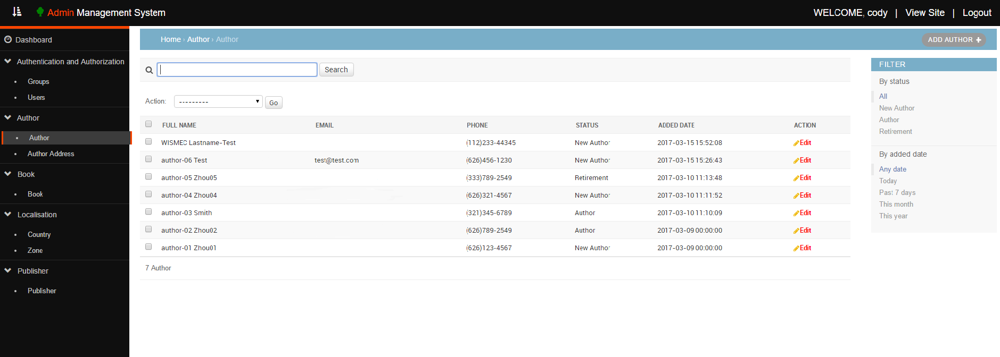

Django---CustomAdminSiteTemplates
=============
Description
-------
  This is an test project for custom admin site templates. It is use Python + Django framework + some necessary technical skills, such as jQuery, CSS3, HTML5, JavaScript and so on, to build custom templates and replace the default django admin site templates.

Installation
--------
  This project is focused on the templates, so it does not need some special libraries. For database, i use PostgresSQL for this test project, so if you want to follow me, you have to install the psycopg2 library. BUT you can use any database which you like, just need to set up the connector and the config file.
  You can find my libraries list in the file requirements.txt, which is in the root folder. For convenience, I list some main libraries of the file as below.
  * python==3.4.4
  * Django==1.10.4
  * psycopg2==2.7

  You can use the command as below to export these libraries. Before you use this command, I seriously recommand you check the libraries list in this file to confirm there is no conflict with your own libraries. Of course, the Virtual Environment is a good idea.

    pip install -r requirements.txt

  OR, you can export the libraries you need by the commands as below.

    pip install Django==1.10.5
    pip install psycopg2==2.7
    pip install python==3.4.4

Screen Shot
------
  ## Custom Login Page
  
  ---
  ## Dashboard Page
  
  ---
  ## Model Page
  
  ---
  ## Edit Model Page
  

Contact Me
------------------------------------------------
  Email: codysbusiness050917@gmail.com
